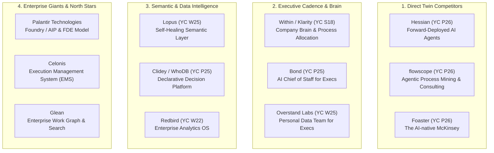

# Bayesforce: Competitive Landscape & Market Intelligence

> **Confidential Internal Strategy Document — September 2026**  
> **Source:** Synthesized from the YC AI Startup Explorer (2,603 AI companies, 453 high-fit candidates), market cartography, and founder strategy memos.

---

## 01. Executive Summary & Market Positioning

Bayesforce is positioned as an **Organizational Execution Intelligence** company under the brand promise:

> **Make More Happen.**  
> *"Systems should carry more of the machinery of an organization so its people can carry more of its ambition."*

In the broader AI landscape (categorized across *Enabling AI, Horizontal Work, Vertical Intelligence, Personal AI, and Embodied AI*), Bayesforce operates primarily in **Horizontal Work > Business Operations > Enterprise Agents & AI Coworkers**, with deep intersections in **General Workflow & Back Office** and **Search, Research & Analytics**.

### The Competitive Vacuum Bayesforce Exploits

The market is currently bifurcated into two failing extremes:

1. **The Legacy Advisory Trap (The "Audit Sellers"):**
   - Traditional strategy consultancies (McKinsey, BCG, Big 4) produce PowerPoint audits, maturity assessments, and 12-month transformation roadmaps.
   - *Failure Mode:* They leave the client with the hardest part—integration, testing, deployment, and change management. They profit from billable hours and scope creep rather than operational speed.
2. **The Point-Solution / Raw Agent Trap (The "Tool Peddlers"):**
   - Thousands of seed-stage YC startups sell off-the-shelf AI agents (generic SDRs, standalone chatbots, or screen-recording bots) without understanding company context, enterprise data governance, or operating rhythms.
   - *Failure Mode:* They cause tool fragmentation, hallucinate on unstructured business data, trigger security pushback, and fail to deliver measurable ROI.

```
       [ HIGH OPERATIONAL EMBEDDING ]
                     │
                     │       ★ BAYESFORCE
                     │       (Forward-Deployed Sprints,
                     │        Semantic Cadence, Client IP)
       Hessian       │
       (FDE Agents)  │       Within (Klarity)
                     │       (Company Brain)
                     │
─────────────────────┼─────────────────────
 [ SOFTWARE ONLY ]   │   [ PURE CONSULTING ]
                     │
       Dock / Bond   │       Foaster / flowscope
       (Coworkers)   │       (AI-native McKinsey)
                     │
       Generic Tools │       Legacy Tier-1
       (Chatbots)    │       (Billable-Hour Decks)
                     │
       [ LOW OPERATIONAL EMBEDDING ]
```

**Bayesforce’s Unfair Wedge:**  
**"Sell the intervention, not the report."** Bayesforce enters through a time-bounded **Execution Diagnostic & Automation Sprint** (2–4 weeks, £3k–£7k fixed), targeting one expensive, recurring operational cadence (e.g., the management operating review), delivers a quantified operational delta into production, and productizes the underlying execution layer.

---

## 02. The Four Competitive Clusters

The competition maps across four distinct clusters:



---

## 03. Head-to-Head Battlecards (Top 5 Closest Competitors)

### 1. Hessian (YC P26)
- **Tagline:** *Forward-deployed AI Agents*
- **URL:** [https://hessian.sh](https://hessian.sh) | **HQ:** San Francisco | **Founders:** Cambridge / Bloomberg SWEs
- **Proposition:** Hessian deploys engineers on-site to map operational work, builds custom agents on their internal platform, and operates the agents end-to-end for clients. They own and operate the software daily, saving customers hundreds of hours a month.
- **Where They Are Strong:**
  - Pure execution focus; understands that enterprise clients want outcomes, not another software login.
  - Elite engineering credentials (ex-Bloomberg data platform processing billions of records, Cambridge ML research).
- **Where They Are Vulnerable:**
  - **Platform Lock-in:** Hessian explicitly states they *"own the software and operate it every day"*, creating proprietary vendor dependency. Mid-market and enterprise buyers are increasingly wary of black-box vendor lock-in.
  - **High Headcount Overhead:** On-site forward-deployment in the US is extremely expensive and hard to scale without massive venture funding.
- **How Bayesforce Wins Against Hessian:**
  - **100% Client IP Guarantee:** Bayesforce delivers source code, prompt topologies, and workflow definitions directly to the client's repository. We build institutional capability, not vendor dependency.
  - **Capital-Efficient Delivery:** Remote systems engineering from India paired with UK/global front-of-house presence allows Bayesforce to offer accessible sprint pricing (£3k–£7k) with high gross margins.

---

### 2. flowscope (YC P26)
- **Tagline:** *AI-native consulting to map and automate business processes*
- **URL:** [https://flowscope.com](https://flowscope.com) | **HQ:** San Francisco | **Founders:** Ex-McKinsey QuantumBlack, Harvard MBA, Imperial College
- **Proposition:** An AI-native transformation consulting firm that deploys agents to map, optimize, and automate companies’ processes end-to-end without human intervention—doing what consulting firms charge millions for at a fraction of the cost and time.
- **Where They Are Strong:**
  - Top-tier consulting pedagogy (McKinsey QuantumBlack methodology combined with agentic process mining).
  - Understands the enterprise transformation buyer (COOs, transformation officers).
- **Where They Are Vulnerable:**
  - **Overpromising Full Autonomy:** Claiming to automate processes *"end to end without human intervention"* triggers enterprise skepticism and compliance barriers (data privacy, hallucination liability).
  - **Process Mining Drag:** Traditional process mining requires complex event-log integrations that take months to configure.
- **How Bayesforce Wins Against flowscope:**
  - **Governed Human-in-the-Loop:** Bayesforce starts in *recommend, prepare, and route* mode with explicit human sign-off on consequential actions. Full autonomy is unlocked only after empirical audit trails prove stability.
  - **Focus on the Cadence, Not Just the Map:** We don't just map abstract processes; we wire directly into the weekly operating review.

---

### 3. Foaster (YC P26)
- **Tagline:** *The AI-native McKinsey, starting with AI transformation*
- **URL:** [https://foaster.ai](https://foaster.ai) | **HQ:** San Francisco | **Founders:** AI consultancy founders, viral LLM researchers
- **Proposition:** Deploys AI agents that interview employees at scale, map actual workflows, identify bottlenecks, and draft an AI transformation roadmap in 2 weeks. Expert human consultants review outputs and add judgment.
- **Where They Are Strong:**
  - Clear, compelling 2-week wedge.
  - Understands that interviewing employees surfaces the qualitative "shadow processes" hidden from system logs.
- **Where They Are Vulnerable:**
  - **Still Selling the Roadmap:** Despite the AI veneer, Foaster's core output is still a *transformation roadmap and recommendations*. It leaves the client with the burden of building and executing the technical integrations.
- **How Bayesforce Wins Against Foaster:**
  - **Sell the Intervention, Not the Roadmap:** Bayesforce's 2–4 week sprint does not stop at a report. It finishes with **one working automation or decision view live in production** with a verified operational delta.

---

### 4. Within / formerly Klarity (YC S18)
- **Tagline:** *Company Brain for people and agents to work in harmony*
- **URL:** [https://within.ai](https://within.ai) | **Scale:** 120+ employees, Series B, San Francisco
- **Proposition:** A platform that maps how work gets done (via web app screen observation), structures enterprise activity into a Company Brain (decisions, approvals, controls), and reallocates work between humans and agents. Clients include OpenAI, DoorDash, Salesforce, and ServiceNow.
- **Where They Are Strong:**
  - Proven enterprise adoption with elite tech and Fortune 500 logos.
  - Deep architectural thinking on how company knowledge links to agentic execution.
- **Where They Are Vulnerable:**
  - **Heavy Enterprise Sales Cycle:** Built for large enterprises with 6-to-12-month procurement cycles and 6-figure ACVs.
  - **Screen-Recording Privacy Backlash:** Asking employees to share their screens for background task mapping faces severe friction in mid-market professional services (client NDA, GDPR, employee trust).
- **How Bayesforce Wins Against Within:**
  - **Accessible Mid-Market Focus:** Purpose-built for 50–250 person professional-services firms that cannot afford or stomach a massive 9-month Klarity implementation.
  - **API & Artifact-Based Discovery:** Bayesforce discovers workflows through existing operational data, API logs, exported sheets, and structured stakeholder interviews—never intrusive screen recording.

---

### 5. Bond (YC P25)
- **Tagline:** *Your AI Chief of Staff*
- **URL:** [https://www.bondapp.io](https://www.bondapp.io) | **HQ:** San Francisco | **Founders:** Techstars / YC alumni
- **Proposition:** Sits across company communication and project management tools to give CEOs and COOs real-time visibility into what’s happening, what changed, and where to focus, saving executives 10+ hours a week.
- **Where They Are Strong:**
  - Razor-sharp buyer hook: every executive wants a Chief of Staff to summarize reality and flag risks.
  - Direct value metric (10+ hours saved per week).
- **Where They Are Vulnerable:**
  - **Passive SaaS Tool:** Bond is primarily a read-only or conversational digest tool. It shows executives what is happening, but it does not execute the underlying operational workflows or fix broken system seams.
- **How Bayesforce Wins Against Bond:**
  - **From Visibility to Execution:** Bayesforce combines the executive visibility layer (*Performance Intelligence*) with active execution agents (*Workflow Agents*) that draft the follow-ups, reassign tickets, and reconcile cross-system discrepancies.

---

## 04. Module-by-Module Competitor Landscape

Bayesforce's architecture maps directly against specific startup clusters identified in our research universe:

| Bayesforce Product Module | Canonical Function Scope | Direct Competitors / Inspirations | Why Bayesforce Wins |
| :--- | :--- | :--- | :--- |
| **Bayesforce Intelligence** *(The Shared Foundation)* | **F19, F22, F25, F26**<br/>• Company brain & context<br/>• Knowledge search<br/>• Document extraction<br/>• Meeting capture | • **Within** (YC S18)<br/>• **Glean** (Enterprise Search)<br/>• **Dashworks** (YC W21)<br/>• **Hyper** (YC P26)<br/>• **Savant** (YC P26) | We never sell the context layer as a standalone tool. We sell it embedded underneath a business intervention. Competitors struggle with standalone adoption; Bayesforce embeds the knowledge layer inside live workflows. |
| **Bayesforce Performance Intelligence** *(The Primary Wedge)* | **F16, F17, F18, F21**<br/>• BI & data analysis<br/>• Decision intelligence & semantic models<br/>• Executive report generation<br/>• Spreadsheet modeling | • **Lopus** (YC W25)<br/>• **Clidey / WhoDB** (YC P25)<br/>• **Overstand Labs** (YC W25)<br/>• **Redbird** (YC W22)<br/>• **Watto AI** (YC S23) | Most BI tools generate static dashboards that operators ignore. Bayesforce produces an **empirical operating review with traceable evidence**, automated variance explanations, and assigned action owners. |
| **Bayesforce Workflow Agents** *(The Scaled Execution Layer)* | **F23, F24, F27, F28**<br/>• Process redesign<br/>• Enterprise agent execution<br/>• Internal tools & apps<br/>• Work & goal management | • **Hessian** (YC P26)<br/>• **Backdrop** (YC W23)<br/>• **Dock** (YC S26)<br/>• **BaseFrame** (YC W26)<br/>• **Motion** (YC W20) | Unlike generic agent builders that operate in a vacuum, our agents execute against the strict semantic definitions and guardrails established by Bayesforce Performance Intelligence. |
| **Bayesforce Revenue Ops** *(Phase 2 Expansion)* | **F01 – F07**<br/>• Inbound/outbound prospecting<br/>• CRM sync & hygiene<br/>• Call intelligence & coaching<br/>• Proposal & RFP generation | • **AiSDR** (YC S23)<br/>• **Avina** (YC S22)<br/>• **Artisan** (YC W24)<br/>• **crmCopilot** (YC W24)<br/>• **Enable Us** (YC S21) | Competitors sell point automations (e.g. spamming outbound emails). Bayesforce connects revenue operations to delivery capacity and client profitability. |
| **Bayesforce Customer Ops** *(Phase 2 Expansion)* | **F08, F10, F11, F12**<br/>• Support resolution<br/>• Knowledge base auto-updates<br/>• Customer intelligence<br/>• Account health & retention | • **Pylon** (YC W23)<br/>• **Sierra** (Enterprise Conversational)<br/>• **Decagon** (Enterprise Support)<br/>• **Ambral** (YC S25)<br/>• **Ariglad** (YC W23) | We focus on customer operations for high-touch professional services where trust, contract fidelity, and human escalation guardrails matter more than deflection volume. |

---

## 05. The Enterprise Reference Models (North Stars Outside YC)

To understand where Bayesforce evolves in Years 3–5, we look at the defining enterprise software archetypes:

### 1. Palantir Technologies (Foundry + AIP)
- **The Lesson:** Palantir realized twenty years ago that enterprise data is fundamentally fragmented across legacy silos. Instead of asking clients to replace SAP or Oracle, Palantir embedded Forward-Deployed Engineers (FDEs) to construct an **Ontology**—a digital twin of the business (entities, properties, relationships, and actions).
- **Bayesforce Application:** Bayesforce is the **democratized, mid-market Palantir for professional services**. We build an operational ontology of the firm (clients, engagements, consultants, deliverables, margins, and cadence) without requiring an eight-figure annual budget.

### 2. Celonis (Execution Management System)
- **The Lesson:** Transactional systems record data; Celonis sits above them to identify **execution friction** (where processes stall, loop, or breach SLAs) and injects automated action flows.
- **Bayesforce Application:** Bayesforce brings process intelligence to mid-market knowledge work where work is not tracked in SAP, but scattered across Slack, Jira, Gmail, Salesforce, and Excel spreadsheets.

---

## 06. Feature & Positioning Comparison Matrix

| Capability / Dimension | Legacy Consulting (McKinsey/BDO) | Generic SaaS / Agent Tools (SDR bots, Zapier) | AI Transformation Startups (Foaster, flowscope) | **Bayesforce Consulting & Systems** |
| :--- | :--- | :--- | :--- | :--- |
| **Primary Output** | PowerPoint deck & strategic recommendations | Software seat / API subscription | Process maps & AI transformation roadmaps | **Production workflow intervention & measured operational delta** |
| **Time to Value** | 3 to 9 months | Days (self-serve, but low organizational impact) | 2 to 4 weeks (for report) | **2 to 4 weeks (for working system in production)** |
| **System Ownership** | Client owns advisory slides; no code delivered | Proprietary vendor lock-in | Proprietary agent platform | **100% Client Ownership (Code, prompts, & configs in client Git)** |
| **Data Grounding** | Manual analyst interviews & surveys | Naive prompt engineering / generic RAG | Agentic screen or document ingestion | **Governed Semantic Layer & Bayesian belief updating** |
| **Execution Risk** | Client must find engineering capacity to build recommendations | Client must configure and maintain integrations | High (often claims full autonomy without guardrails) | **Low (Graduated autonomy: Recommend → Prepare → Route → Approve)** |
| **Commercial Alignment** | Billable hours & team size (incentivizes delay) | Per-seat monthly subscription (incentivizes seat inflation) | Fixed advisory fee | **Modest sprint fee + value-aligned outcome pricing** |

---

## 07. Strategic Rules: What to Emulate vs. What to Avoid

### What Bayesforce Must Emulate
1. **The Forward-Deployed Mindset (from Hessian & Palantir):** Enter the client's messy reality. Do not demand clean data upfront. Map the real process across the seams.
2. **The 2–4 Week Time-Bounded Sprint (from Foaster):** Limit the scope to one painful, recurring workflow. Establish a quantified baseline (hours, error cost, cycle time) on Day 1.
3. **The Executive Operating Hook (from Bond & Overstand):** Target the COO, Managing Director, or CFO around their weekly operational cadence. That is where urgent budget lives.

### Traps Bayesforce Must Actively Avoid
1. **The "Passive Audit" Trap:** Never deliver a recommendation deck without an accompanying production intervention. A recommendation without implementation is just another backlog item for an overworked COO.
2. **The "Screen Recording Surveillance" Trap:** Avoid passive desktop tracking (BaseFrame, Within). In UK/European professional services, GDPR concerns and employee resistance kill deals before they start.
3. **The "Full Autonomy" Trap:** Never promise that an AI agent will run a department autonomously without human supervision. Professional services firms sell trust and accountability; emphasize **human-governed agency with empirical audit trails**.
4. **The "Generic Chatbot" Stigma:** Never use the words "chatbot" or "custom GPT". Position exclusively around **Execution Cadence, Decision Intelligence, and Workflow Capacity**.
